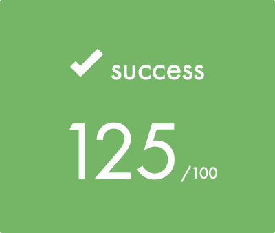

<h1 align="center"> Libft [42 School] </h1>

  

<!-- 

  

 -->

Summary:

This project is about coding a C library. 
It will contain a lot of general purpose functions your programs will rely upon.

<a href="./RMfile/en.subject.pdf">Subject</a>

